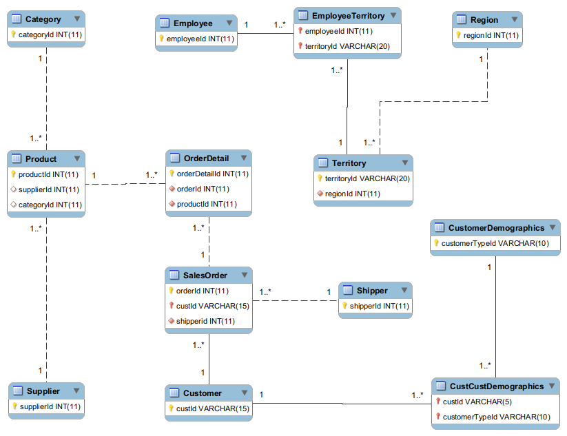
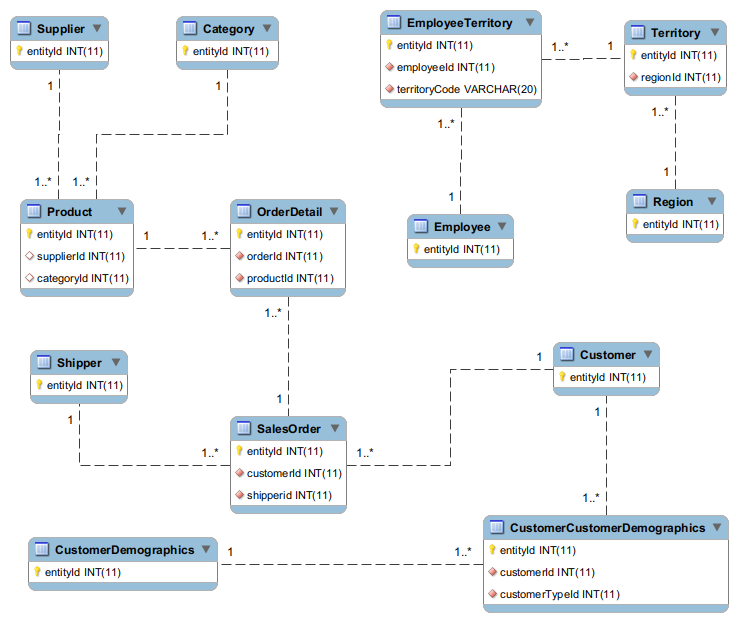

Northwind sample database for MySql, PostgresQL, and more
====

This project is inspired by [Microsoft Sample Databases](https://github.com/Microsoft/sql-server-samples), but it only targets other databases, such as MySql, PostgresQL, etc. 

This folder contains scripts to create and load the Northwind sample databases.


If you are looking for the script of MS Sql Server, please check out the repository from their github.

This project is created to create a sample CRM-like demo database in a few seconds with tiny test data.

### Caveat

The sample databases in the project are customized. Some tables' and columns' names have been changed on purpose. 

### Difference from the sample of MS Sql Server

* Additional columns on some tables, e.g. email, mobile. 
* All photo sample data has been removed, and additional photoPath is added for flexible implementation.
* NorthwindCore is designed for Entity Framework

### ER Diagram

* The ER diagram only contains PK and FKs
* The ER file is created by MySQl Workbrench. You can open the file with the same tool.

#### Northwind 




####  NorthwindCore


* Every table in NorthwindCore contains column EntityId.  




### Restore the database from SQL script

#### MySql

```bash
mysql -u user_id -p northwind < northwind.sql
```


#### PostgresQL


```
sudo su - postgres
psql -d postgres -U postgres -f northwind.sql
```

#### MongoDB

* Firstly, install MongoDB community server, shell and tools
* Launch the mongoDB server

```
# Launch mongodb in Linux 
systemctl start mongod

```

* Create the db northwind and import the data

```
sh mongo_import.sh

echo "db.getCollectionNames()" > getColNames.js

mongo mongodb://localhost/northwind < getColNames.js

# You may see some output as follow:
# .......
# ......
# MongoDB server version: x.x.x
# [
# 	"category",
# 	"customer",
# 	"employee",
# 	"employeeTerritory",
# 	"orderDetail",
# 	"product",
# 	"region",
# 	"salesOrder",
# 	"shipper",
# 	"supplier",
# 	"territory"
# ]

```

#### Sqlite

* Install [sqlite3](https://www.sqlite.org/)
* Create northwind db

```
cd db-samples/sqlite3
sqlite3 northwind.db < northwind_core.sql
sqlite3 northwind.db
>.tables
```

#### Json Flat file

* Json flat file is great for intergation test or demostraction
* Folder json contains a few json flat files
* json_data.min.json is the original data set
* json_tiny.json is version with only a small data set


### TODO

* ~~Add script for MongoDB~~
* ~~Add script for Sqlite~~


